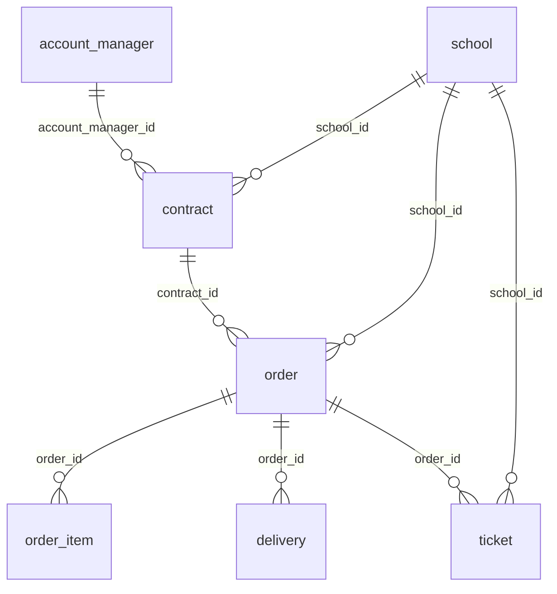

# Documentação do Projeto
## Case Técnico — Analytics Engineer · Arco Educação

---

> **Candidato:** Jonathan  
> **Repositório:** github.com/JonathaMel0/arco-case-analytics-eng  
> **Data de entrega:** Agosto de 2026

---

# Seção 1 — Documentação Técnica

## 1.1 Stack tecnológica

| Componente | Tecnologia | Versão | Papel |
|---|---|---|---|
| Data Warehouse | Google BigQuery | — | Armazenamento e processamento de todas as camadas |
| Transformação | dbt (data build tool) | 1.12.0 | Modelagem, testes e documentação |
| Adapter dbt | dbt-bigquery | 1.12.0 | Integração dbt ↔ BigQuery |
| Pacote dbt | dbt_utils | 1.4.1 | Geração de surrogate keys |
| Visualização | Metabase | — | Dashboard analítico |
| Linguagem | Python | 3.13.5 | Carga inicial dos dados raw |
| Controle de versão | Git + GitHub | — | Versionamento do projeto |
| Autenticação GCP | Application Default Credentials (OAuth) | — | Acesso ao BigQuery via gcloud |

---

## 1.2 Infraestrutura Google Cloud

**Projeto GCP:** `arco-analytics-eng`  
**Região:** `southamerica-east1` (São Paulo)

### Datasets criados no BigQuery

| Dataset | Propósito | Tipo de objetos |
|---|---|---|
| `raw` | Dados brutos ingeridos dos CSVs originais | Tabelas permanentes |
| `clean` | Dados padronizados, uma view por tabela raw | Views |
| `curated` | Entidades de negócio unificadas entre sistemas | Tabelas |
| `report` | Agregados prontos para consumo analítico | Tabelas |

### Service accounts

| Service Account | Permissões | Uso |
|---|---|---|
| Conta pessoal (OAuth) | `roles/bigquery.dataEditor` | Execução do dbt |
| `metabase-reader` | `roles/bigquery.dataViewer` | Leitura pelo Metabase |

---

## 1.3 Configuração do dbt

### profiles.yml

```yaml
arco_analytics:
  target: dev
  outputs:
    dev:
      type: bigquery
      method: oauth
      project: arco-analytics-eng
      dataset: dbt_dev          # sobrescrito pela macro generate_schema_name
      location: southamerica-east1
      threads: 4
```

### Macro generate_schema_name

O dbt, por padrão, prefixa o nome do dataset alvo com o dataset do perfil (`dbt_dev_clean`, `dbt_dev_curated`). Para gerar os datasets `clean`, `curated` e `report` diretamente, foi criada a macro abaixo:

```sql
-- macros/generate_schema_name.sql

    
        {{ default_schema }}
    
        {{ custom_schema_name | trim }}
    

```

Isso garante que `+schema: clean` no `dbt_project.yml` produza o dataset `clean`, não `dbt_dev_clean`.

### dbt_project.yml — materialização por camada

```yaml
models:
  arco_analytics:
    clean:
      +materialized: view
      +schema: clean
    curated:
      +materialized: table
      +schema: curated
    report:
      +materialized: table
      +schema: report
```

---

## 1.4 Decisões técnicas de implementação

### Surrogate keys com dbt_utils

As entidades `order`, `order_item` e `delivery` consolidam dados de múltiplos sistemas. Para gerar um `*_id` único e estável independente do sistema de origem, foi utilizado `dbt_utils.generate_surrogate_key`:

```sql
{{ dbt_utils.generate_surrogate_key(['source_system', 'source_order_id']) }} AS order_id
```

Isso produz um hash MD5 determinístico — o mesmo input sempre gera o mesmo ID, permitindo joins estáveis entre as camadas.

### Filtro de datas inválidas

Durante a implementação foram identificados **4 registros em `erp_a_delivery`** com `delivery_date = 2204-12-31` (typo de `2024`). O filtro foi aplicado no modelo curated que consolida as fontes de entrega:

```sql
-- curated__school_operations__event__delivery.sql
SELECT * FROM final
WHERE EXTRACT(YEAR FROM delivery_date) BETWEEN 2010 AND 2030
```

A escolha de filtrar no curated (e não no clean) garante que o filtro cubra tanto a fonte ERP A quanto a fonte financeira (fin), que convergem nessa tabela.

### Ano de referência no modelo YTD

O modelo `report__ytd__am_portfolio_metrics` foi projetado para filtrar pelo "ano corrente". Com dados históricos (encerrados em 2025), `CURRENT_DATE()` retornaria 2026 e zeraria todos os agregados. A solução foi extrair o ano de referência dos próprios dados:

```sql
ref_year AS (
    SELECT MAX(EXTRACT(YEAR FROM order_date)) AS year
    FROM curated__school_operations__event__order
)
```

Todos os CTEs do modelo usam `(SELECT year FROM ref_year)` como filtro, tornando o modelo autocontido e adaptável a qualquer período de dados.

### Linkagem ticket → escola

A campo `cnpj_cliente` do `support_ticket` estava vazio em 1.002 dos 1.500 registros, tornando o join direto `ticket.cnpj_cliente → school.cnpj` ineficaz (0 matches). A rota correta descoberta na exploração dos dados é:

```
ticket.organization_id
    → support_organization.cnpj
    → curated_school.cnpj
```

Resultado: 574 tickets com escola identificada (38% do total).

### Full refresh vs. incremental

Por tratar-se de um case com volume de dados fixo e limitado (~20k linhas por tabela de report), todos os modelos curated e report foram materializados como `table` com `full refresh`. Em produção, o recomendado seria:

| Tabela | Estratégia de produção |
|---|---|
| `curated__...__current__*` | `full refresh` diário (volume pequeno, SCDs simples) |
| `curated__...__event__order` | `incremental` por `order_date` |
| `curated__...__event__delivery` | `incremental` por `delivery_date` |
| `report__*` | `full refresh` diário (depende do curated) |

---

## 1.5 Carga inicial dos dados (raw)

Os 20 CSVs foram carregados no dataset `raw` do BigQuery via script Python (`upload_to_bigquery.py`), utilizando a biblioteca `google-cloud-bigquery` com inferência automática de schema:

```python
job_config = bigquery.LoadJobConfig(
    autodetect=True,
    skip_leading_rows=1,
    source_format=bigquery.SourceFormat.CSV,
    write_disposition="WRITE_TRUNCATE",
)
```

Este script é de uso único (idempotente via `WRITE_TRUNCATE`) e não faz parte do pipeline de produção.

---

---

# Seção 2 — Documentação do Projeto

## 2.1 Visão geral

O projeto implementa uma **camada analítica completa** para a Arco Educação, integrando dados de 5 sistemas operacionais distintos em um modelo unificado capaz de responder às duas perguntas centrais do negócio:

1. Visão consolidada de venda por escola ao longo do tempo
2. Performance de carteira por Account Manager no ano corrente

A entrega inclui modelagem em três camadas (clean → curated → report), 130 testes automatizados de qualidade e um dashboard executivo com 13 cards no Metabase.

---

## 2.2 Fontes de dados

| Sistema | Tabelas | Responsabilidade |
|---|---|---|
| **CRM** | `crm_account`, `crm_user`, `crm_product`, `crm_service_contract`, `crm_contract_line_item` | Cadastro de escolas, contratos, AMs |
| **ERP A** | `erp_a_customer`, `erp_a_salesperson`, `erp_a_sales_order`, `erp_a_sales_order_item`, `erp_a_delivery`, `erp_a_invoice` | Pedidos e entregas da marca principal |
| **ERP B** | `erp_b_escola`, `erp_b_vendedor`, `erp_b_pedido`, `erp_b_item_pedido` | Pedidos da marca legado |
| **Financeiro** | `fin_nota_fiscal` | Entregas dos pedidos do ERP B |
| **Suporte** | `support_organization`, `support_user`, `support_ticket`, `support_ticket_tag` | Tickets de atendimento pós-venda |

**Principal desafio de integração:** a mesma escola aparece nos 5 sistemas com identificadores diferentes. A reconciliação é feita por **CNPJ normalizado** (14 dígitos, sem formatação) como chave de linkagem cross-system.

---

## 2.3 Arquitetura de camadas

```
[raw]        20 tabelas — dados brutos dos CSVs, sem transformação
    ↓
[clean]      20 views — padronização de tipos, renomeação, normalização de status
    ↓
[curated]    17 tabelas — entidades unificadas entre sistemas
    ↓
[report]     2 tabelas — agregados analíticos prontos para consumo
```

### Camada clean — regras aplicadas

- Conversão de tipos (strings para DATE, INT64, BOOLEAN)
- Normalização de CNPJ: `REGEXP_REPLACE(cnpj, '[^0-9]', '')` → 14 dígitos
- Normalização de status (ERP B tinha 15 valores para 3 conceitos)
- Derivação de campos booleanos: `is_cancelled`, `is_active`, `is_deleted`
- Filtro de dados inválidos: datas fora do intervalo 2010–2030

### Camada curated — entidades do domínio `school_operations`

| Modelo | Grão | Fontes |
|---|---|---|
| `current__school` | 1 linha por escola | CRM + ERP A + ERP B + Suporte |
| `current__account_manager` | 1 linha por AM | CRM |
| `event__contract` | 1 linha por contrato | CRM |
| `event__order` | 1 linha por pedido | ERP A + ERP B |
| `event__order_item` | 1 linha por item de pedido | ERP A + ERP B |
| `event__delivery` | 1 linha por entrega | ERP A delivery + fin nota fiscal |
| `event__ticket` | 1 linha por ticket | Suporte |

### Camada report — tabelas analíticas

| Modelo | Grão | Responde |
|---|---|---|
| `monthly__school_order_metrics` | escola × mês | P1: evolução mensal por escola |
| `ytd__am_portfolio_metrics` | AM × ano | P2: performance de carteira por AM |

---

## 2.4 Convenção de nomenclatura

```
<camada>__<domínio/sistema>__<tipo>__<entidade>

Tipos:
  current → estado atual de uma entidade (snapshot)
  event   → registro de um evento no tempo
  monthly → agregação mensal
  ytd     → year-to-date (acumulado no ano)

Exemplos:
  clean__crm__current__account
  curated__school_operations__event__order
  report__school_operations__monthly__school_order_metrics
```

---

## 2.5 Estrutura de pastas (dbt)

```
dbt_arco/
├── dbt_project.yml
├── packages.yml
├── macros/
│   └── generate_schema_name.sql
└── models/
    ├── sources.yml
    ├── clean/
    │   ├── crm/         schema.yml + 5 modelos
    │   ├── erp_a/       schema.yml + 5 modelos
    │   ├── erp_b/       schema.yml + 4 modelos
    │   ├── fin/         schema.yml + 1 modelo
    │   └── support/     schema.yml + 4 modelos
    ├── curated/
    │   └── school_operations/
    │       ├── school/
    │       │   ├── staging/    4 stagings (crm, erp_a, erp_b, support)
    │       │   └── curated__school_operations__current__school.sql
    │       ├── account_manager/   schema.yml + 1 modelo
    │       ├── contract/          schema.yml + 1 modelo
    │       ├── order/
    │       │   ├── staging/    2 stagings (erp_a, erp_b)
    │       │   └── schema.yml + curated__...__event__order.sql
    │       ├── order_item/        schema.yml + 2 stagings + 1 modelo
    │       ├── delivery/          schema.yml + 2 stagings + 1 modelo
    │       └── ticket/            schema.yml + 1 modelo
    └── report/
        └── school_operations/
            ├── schema.yml
            ├── report__school_operations__monthly__school_order_metrics.sql
            └── report__school_operations__ytd__am_portfolio_metrics.sql
```

---

## 2.6 Testes de qualidade

130 testes dbt distribuídos em 13 arquivos `schema.yml`, cobrindo todas as camadas.

```
dbt test → Done. PASS=130 WARN=0 ERROR=0
```

| Tipo de teste | O que valida | Exemplos |
|---|---|---|
| `unique` | PK sem duplicatas | `order_id`, `school_id`, `ticket_id` |
| `not_null` | Campos obrigatórios preenchidos | `cnpj`, `order_date`, `crm_account_id` |
| `accepted_values` | Domínio controlado de enumerações | `source_system IN ('erp_a','erp_b')`, `status IN ('open','closed','cancelled')` |
| `relationships` | Integridade referencial entre entidades | `order_item.order_id → order.order_id` |

---

## 2.7 Diagrama do modelo curated



---

---

# Seção 3 — Documentação do Dashboard

## 3.1 Visão geral

**Nome:** School Operations — Visão Executiva  
**Ferramenta:** Metabase  
**Fonte de dados:** BigQuery (`arco-analytics-eng`) — datasets `report` e `curated`  
**Atualização:** conforme reprocessamento dos modelos dbt  

O dashboard foi construído para responder diretamente às duas perguntas de negócio do case, organizadas em storytelling do macro para o micro: KPIs executivos → tendências financeiras → saúde da entrega → suporte → ranking por escola → ranking por AM.

---

## 3.2 Perguntas de negócio respondidas

| Pergunta | Como o dashboard responde |
|---|---|
| **P1 — Visão consolidada por escola ao longo do tempo** | Seção 5 (Top 10 Escolas) + Seções 2 e 3 com filtro "Escola" para drill-down individual |
| **P2 — Performance de carteira por AM no ano corrente** | Seção 6 (Tabela YTD por AM + Ranking visual) |

---

## 3.3 Filtros globais

| Filtro | Campo | Cards conectados |
|---|---|---|
| **Período** | `month` | Cards 5, 6, 7, 9, 13 |
| **Estado** | `state` | Cards 5, 6, 8, 13 |
| **Escola** | `school_name` | Cards 5, 6, 7, 9 |

> Com o filtro Escola ativado, os gráficos de tendência (Cards 5, 6, 7, 9) passam a mostrar a visão individual da escola selecionada — completando a resposta à P1.

---

## 3.4 Cards do dashboard

### Seção 1 — KPIs Executivos

Quatro métricas em linha, mostrando o estado atual do negócio no ano de referência (2025).

| Card | Métrica | Fonte | Tipo |
|---|---|---|---|
| 1 | Valor Total Pedido YTD | `ytd__am_portfolio_metrics` · SUM `ordered_amount` | Number |
| 2 | Escolas Atendidas YTD | `ytd__am_portfolio_metrics` · SUM `total_schools_served` | Number |
| 3 | Contratos Ativos YTD | `ytd__am_portfolio_metrics` · SUM `total_contracts` | Number |
| 4 | Taxa de Entrega Bem-sucedida | `monthly__school_order_metrics` · `successful_deliveries / total_deliveries` | Number (%) |

> Card 4 tem goal line em 90% como referência de SLA.

---

### Seção 2 — Tendência Financeira

Mostra a evolução do volume comercial mês a mês.

| Card | Título | O que mostra | Tipo |
|---|---|---|---|
| 5 | Faturamento Mensal (R$) | Valor pedido agregado por mês (SUM `ordered_amount`) | Line chart |
| 6 | Pedidos por Mês | Pedidos ativos (verde) vs. cancelados (vermelho) empilhados | Bar chart stacked |

> Card 5 com trend line ativada para evidenciar sazonalidade ou crescimento.

---

### Seção 3 — Saúde da Entrega

Avalia se os pedidos estão sendo entregues com sucesso.

| Card | Título | O que mostra | Tipo |
|---|---|---|---|
| 7 | Taxa de Entrega por Mês (%) | `successful_deliveries / total_deliveries × 100` ao longo do tempo | Line chart |
| 8 | Volume Entregue por Estado | `quantity_delivered` agregado por estado, ranking decrescente | Bar chart horizontal |

> Card 7 com goal line em 90% e eixo Y fixo 0–100.

---

### Seção 4 — Suporte

Correlaciona volume de atendimento com o ritmo operacional.

| Card | Título | O que mostra | Tipo |
|---|---|---|---|
| 9 | Tickets de Suporte por Mês | Quantidade de tickets abertos por mês | Line chart (9/24 col) |
| 10 | Tempo Médio de Resolução | AVG `resolution_hours` YTD | Number (3/24 col) |

> Pico de tickets correlacionado com pico de cancelamentos (Cards 6 e 9 lado a lado) sinaliza problema operacional.

---

### Seção 5 — Visão por Escola *(fecha P1 do case)*

| Card | Título | O que mostra | Tipo |
|---|---|---|---|
| 13 | Top 10 Escolas por Volume Pedido | Ranking das 10 maiores escolas por `ordered_amount` acumulado | Bar chart horizontal |

> Ao selecionar uma escola no filtro global, os Cards 5, 6, 7 e 9 automaticamente mostram a visão histórica daquela escola — respondendo à P1 individualmente.

---

### Seção 6 — Performance por Account Manager *(fecha P2 do case)*

| Card | Título | O que mostra | Tipo |
|---|---|---|---|
| 11 | Portfolio YTD por AM | Tabela completa com métricas por AM (escolas, valor, pedidos, contratos, tickets) | Table |
| 12 | Faturamento por AM | Ranking visual de AMs por volume pedido YTD | Bar chart horizontal |

**Colunas da tabela (Card 11):**

| Coluna | Descrição |
|---|---|
| `account_manager` | Nome do AM |
| `escolas_atendidas` | Quantidade de escolas ativas na carteira |
| `valor_pedido_brl` | Volume total pedido no ano (R$) |
| `pedidos` | Quantidade de pedidos |
| `contratos` | Contratos ativos |
| `tickets` | Tickets de suporte da carteira |
| `resolucao_media_horas` | Tempo médio de resolução de tickets |

---

## 3.5 Layout do dashboard (grade 24 colunas)

```
Linha 1: [Card 1 · 6col] [Card 2 · 6col] [Card 3 · 6col] [Card 4 · 6col]
Linha 2: [Card 5 · 12col]                [Card 6 · 12col]
Linha 3: [Card 7 · 12col]                [Card 8 · 12col]
Linha 4: [Card 9 · 18col]                [Card 10 · 6col]
Linha 5: [Card 13 · 24col]    ← P1
Linha 6: [Card 11 · 24col]    ← P2
Linha 7: [Card 12 · 24col]    ← P2
```

---

## 3.6 Decisões do dashboard

**Uso de SQL nativo vs. modelo GUI:** Cards com cálculos derivados (divisão, percentual, arredondamento) usam SQL nativo do Metabase para evitar limitações do construtor visual. Cards com agregações simples (SUM, COUNT + GROUP BY) usam o modo modelo (GUI).

**Aliases em snake_case:** o BigQuery rejeita aliases com caracteres especiais (`(`, `)`, `$`, espaços). Todos os aliases nas queries SQL usam apenas letras, números e `_`.

**Ano de referência:** os cards baseados em `ytd__am_portfolio_metrics` refletem o ano 2025 (máximo nos dados). Em produção com dados em tempo real, o modelo se atualizaria automaticamente para o ano corrente.
