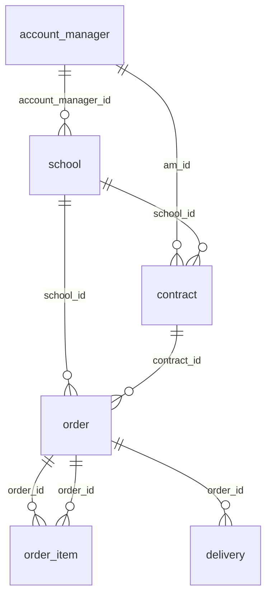

# RFC — Modelagem Analítica: Visão Consolidada de Vendas por Escola e Performance de Carteira por AM

| Campo        | Valor                              |
|:-------------|:-----------------------------------|
| **Autor**    | Jonathan                           |
| **Status**   | Proposta                           |
| **Data**     | 2026-08-04                         |
| **Domínio**  | `school_operations`                |
| **Versão**   | 1.0                                |

---

## 1. TL;DR

Este documento propõe a modelagem analítica para responder a duas perguntas de negócio da equipe comercial da Arco:

1. **Visão consolidada de venda por escola**, mês a mês, nos últimos 12 meses — independente da marca.
2. **Performance de carteira por Account Manager (AM)** — volume vendido pela carteira no ano corrente.

A proposta segue as camadas **clean → curated → report** e a modelagem **entity-centric** do time. O modelo é organizado no domínio `school_operations` e resolve a fragmentação entre 5 sistemas (CRM, ERP A, ERP B, Financeiro, Atendimento) por meio de **CNPJ normalizado** (linkagem de escola) e **ContractNumber** (linkagem de pedido↔contrato).

O achado mais crítico da exploração é que **315 contratos distintos aparecem com pedidos em ambos ERP A e ERP B**, com valores diferentes — esse é o principal risco de dupla contagem e está detalhado na seção de decisões.

---

## 2. Contexto e problema

### 2.1 Ciclo operacional da Arco

A Arco opera um ciclo comercial que vai da prospecção à entrega:

```
escola → contrato (CRM) → pedido (ERP A ou ERP B) → entrega (delivery / nota fiscal) → atendimento (suporte)
```

Cada etapa desse ciclo vive num sistema diferente, implantado em momentos distintos, sem padrão compartilhado de identificação:

| Sistema           | Chave de escola           | Chave de pedido    | Linkagem ao contrato          |
|:------------------|:--------------------------|:-------------------|:------------------------------|
| CRM               | `crm_account.Id`          | —                  | `crm_service_contract.Id`     |
| ERP A             | `erp_a_customer.CardCode` | `erp_a_sales_order.DocEntry` | `NumAtCard` (texto) |
| ERP B             | `erp_b_escola.id_escola`  | `erp_b_pedido.id_pedido` | `num_contrato` (texto) |
| Financeiro        | CNPJ (formatado variável) | —                  | `id_pedido_erp_b`             |
| Atendimento       | `support_organization.id` | `custom_field_order_ref` | — (indireto)          |

### 2.2 Perguntas de negócio

As duas perguntas exigem que o modelo:

1. **Resolva identidade de escola** — a mesma escola pode aparecer nos 5 sistemas com IDs e formatos distintos.
2. **Consolide pedidos de múltiplos ERPs** — ERP A (marca principal) e ERP B (marca legado) geram pedidos independentes.
3. **Atribua os pedidos ao AM responsável** — o responsável pelo contrato no CRM é a fonte de verdade da carteira.

---

## 3. Exploração dos dados — achados relevantes

A exploração foi feita via DuckDB no arquivo `case.duckdb`. Os principais achados que influenciam diretamente a modelagem estão abaixo.

### 3.1 CNPJ: 3 formatos distintos, chave viável após normalização

O CNPJ é o campo mais natural para reconciliar a identidade de escola entre sistemas, mas cada sistema usa um formato diferente:

| Sistema           | Exemplo de CNPJ               | Formato             |
|:------------------|:------------------------------|:--------------------|
| CRM               | `60.480.589/2583-20`          | Formatado com pontuação |
| ERP A             | `82814893252880`              | Somente dígitos (14 chars) |
| ERP B             | `10 433 218 1960 01` ou `40781618495931` | Misto (com espaços ou puro) |
| Financeiro        | `45.494.808/3136-78` ou `94522885158799` | Formatado ou puro |
| Atendimento       | `24026811775891`              | Somente dígitos (quando presente) |

**Após normalização** (`REGEXP_REPLACE(cnpj, '[^0-9]', '', 'g')`):
- CRM (360 contas) → ERP A: **236 matches (65,6%)**
- CRM (360 contas) → ERP B: **226 matches (62,8%)**

As contas sem match representam escolas que podem existir apenas num dos sistemas (ex.: cliente antigo só no ERP B), ou inconsistências de CNPJ nos dados de origem. Esse gap está documentado como premissa.

### 3.2 ContractNumber: linkagem robusta, mas com problema de casing

O número de contrato é a chave mais confiável para ligar pedidos ao contrato CRM:

| Link                          | Contratos CRM | Com match | % match |
|:------------------------------|:-------------:|:---------:|:-------:|
| `CRM.ContractNumber` → `ERP A.NumAtCard` | 380 | 363 | **95,5%** |
| `CRM.ContractNumber` → `ERP B.num_contrato` | 380 | 331 | **87,1%** |

**Problema encontrado:** O ERP B registra o mesmo número de contrato com casing variável (`ARCO-2023-00055` vs `Arco-2023-00055`). A normalização via `UPPER(TRIM(...))` resolve o problema.

O restante dos pedidos sem contrato (346 pedidos no ERP B — 28,8% do total) só podem ser linkados à escola via CNPJ.

### 3.3 Overlap de contratos entre ERP A e ERP B — risco de dupla contagem

**Este é o achado mais crítico da exploração.**

```
315 contratos distintos aparecem com pedidos em AMBOS ERP A e ERP B.
```

Para três contratos de exemplo:

| Contrato        | ERP A — qtd pedidos | ERP A — valor | ERP B — qtd pedidos | ERP B — valor |
|:----------------|:-------------------:|:-------------:|:-------------------:|:-------------:|
| ARCO-2023-00055 | múltiplos           | R$ 510.671    | 1                   | R$ 12.452     |
| ARCO-2023-00071 | múltiplos           | R$ 115.516    | 3                   | R$ 48.995     |
| ARCO-2025-00010 | múltiplos           | R$ 351.106    | 1                   | R$ 23.345     |

Os valores são sempre **diferentes entre os ERPs** para o mesmo contrato. Isso indica que são pedidos distintos (possivelmente de marcas ou ciclos diferentes), não duplicatas técnicas de extração. Uma `UNION ALL` com `source_system` como discriminador é a abordagem proposta — detalhes na seção 5.2.

### 3.4 Status fragmentado no ERP B

O campo `status` em `erp_b_pedido` tem **15 valores distintos** para representar 3 conceitos:

| Conceito         | Valores encontrados                                              |
|:-----------------|:-----------------------------------------------------------------|
| **Cancelado**    | `C`, `cancelado`, `cancelled`, `CANCELLED`                       |
| **Em andamento** | `A`, `P`, `pending`, `PENDING`, `pendente`, `em_andamento`, `IN_PROGRESS` |
| **Entregue**     | `E`, `entregue`, `delivered`, `DELIVERED`                        |

Isso exige mapeamento explícito na camada **clean** antes de qualquer modelagem.

### 3.5 ERP A: dois campos de status, semântica clara

O ERP A é mais consistente:
- `DocStatus = 'O'` + `Cancelled = 'N'` → pedido aberto (em andamento)
- `DocStatus = 'C'` + `Cancelled = 'N'` → pedido fechado (entregue/concluído)
- `Cancelled = 'Y'` → cancelado (independente do DocStatus)

Total de pedidos: 1.800. Cancelados: 92 (5,1%). Não-cancelados: 1.708.

### 3.6 Fluxo de entrega: diferente por ERP

| Sistema | Mecanismo de entrega | Cobertura |
|:--------|:---------------------|:---------:|
| ERP A | `erp_a_delivery` linkado a `DocEntry` | 1.457 / 1.708 pedidos (85,3%) |
| ERP B | `fin_nota_fiscal` linkado a `id_pedido_erp_b` | 701 / 880 pedidos não-cancelados (79,7%) |

Para o ERP B, o sistema financeiro (`fin_nota_fiscal`) é a única fonte de informação de entrega, conforme descrito no enunciado. Os status de entrega na nota fiscal (`entregue`, `em_transito`, `extraviado`, `devolvido`, `aguardando_coleta`) precisam ser mapeados.

### 3.7 Account Manager: fonte no CRM, não linkável via nome nos ERPs

Os vendedores dos ERPs (`erp_a_salesperson`, `erp_b_vendedor`) **não têm linkagem direta** com `crm_user` por nenhum campo disponível nos dados (nomes são diferentes, não há e-mail ou ID compartilhado).

Para a pergunta de performance por AM, a fonte de verdade é o CRM:
- `crm_service_contract.OwnerId → crm_user` identifica qual usuário CRM é responsável pelo contrato
- Usuários com `ProfileName = 'Account Manager'` são os AMs stricto sensu, mas o `OwnerId` do contrato pode ter qualquer perfil

Distribuição de contratos por perfil do dono:

| Perfil          | Contratos |
|:----------------|:---------:|
| Account Manager | 102       |
| CS Manager      | 100       |
| Admin           | 90        |
| Sales Rep       | 88        |

**Ponto em aberto:** Qual o critério correto de "AM" para a pergunta 2? Ver seção 7.1.

### 3.8 Estrutura de contas: School vs Network

O CRM tem dois tipos de account: **310 Schools** e **50 Networks**. 70 escolas têm `ParentId` apontando para uma rede. Para as perguntas de negócio, a unidade de análise é a **escola** (`Type = 'School'`), não a rede. Análises agregadas por rede ficam como extensão futura.

### 3.9 Suporte: linkagem parcial

| Campo de linkagem     | Tickets com preenchimento |
|:----------------------|:-------------------------:|
| `organization_id`     | 1.360 / 1.500 (90,7%)     |
| `custom_field_order_ref` | 614 / 1.500 (40,9%)    |
| `custom_field_cnpj`   | 498 / 1.500 (33,2%)       |

O sistema de suporte não está diretamente no escopo das perguntas de negócio desta v1, mas é modelado na curated para uso futuro (ex.: correlação entre tickets e inadimplência/churn).

---

## 4. Entidades de negócio

Seguindo o modelo entity-centric, identifico as seguintes entidades centrais para responder às perguntas:

| Entidade           | Definição                                       | Grão                         | Fonte principal      |
|:-------------------|:------------------------------------------------|:-----------------------------|:---------------------|
| **School**         | Escola cliente da Arco                          | 1 linha por `school_id`      | CRM (+ ERPs + Suporte) |
| **AccountManager** | Usuário CRM responsável por contratos/carteira  | 1 linha por `am_id`          | CRM                  |
| **Contract**       | Contrato de venda firmado com a escola          | 1 linha por `contract_id`    | CRM                  |
| **Order**          | Pedido de compra gerado por contrato            | 1 linha por `order_id`       | ERP A + ERP B        |
| **OrderItem**      | Item (SKU) de um pedido                         | 1 linha por `order_id + item_id` | ERP A + ERP B    |
| **Delivery**       | Evento de entrega de um pedido                  | 1 linha por `delivery_id`    | ERP A delivery + Fin NF |
| **Ticket**         | Ticket de suporte aberto por escola             | 1 linha por `ticket_id`      | Suporte              |

---

## 5. Modelo proposto

### 5.1 Camada Clean

Uma tabela por tabela raw. Responsabilidade: padronização sem mudança de grão.

**Transformações obrigatórias:**

| Tabela raw           | Transformação principal                                      |
|:---------------------|:-------------------------------------------------------------|
| `crm_account`        | Normalizar `CNPJ__c` → `cnpj` (só dígitos); renomear colunas para snake_case sem `__c` |
| `erp_a_customer`     | Normalizar `CNPJ` → `cnpj` (só dígitos); renomear `CardCode` → `customer_code` |
| `erp_b_escola`       | Normalizar `cnpj` → `cnpj` (só dígitos, remover espaços)    |
| `erp_a_sales_order`  | Derivar `is_cancelled = (Cancelled = 'Y')`;  `status` normalizado (`open`, `closed`, `cancelled`) |
| `erp_b_pedido`       | Mapear 15 valores de status → `status_normalized` (`in_progress`, `delivered`, `cancelled`); derivar `is_cancelled`; `UPPER(TRIM(num_contrato))` → `contract_number` |
| `fin_nota_fiscal`    | Normalizar `cnpj_cliente`; padronizar `status_entrega`       |
| `support_organization` | Normalizar `external_id` → `cnpj` (quando CNPJ, 14 dígitos) |
| `crm_service_contract` | `UPPER(TRIM(ContractNumber))` → `contract_number`; renomear campos; derivar `is_cancelled = (Status = 'Cancelled')` |
| `erp_b_pedido`       | `UPPER(TRIM(num_contrato))` → `contract_number` (para match com CRM) |

**Mapeamento de status ERP B** (lógica da macro `normalize_erp_b_status`):

```sql
CASE
    WHEN UPPER(status) IN ('C', 'CANCELLED', 'CANCELADO') THEN 'cancelled'
    WHEN UPPER(status) IN ('E', 'DELIVERED', 'ENTREGUE') THEN 'delivered'
    ELSE 'in_progress'  -- A, P, PENDING, pendente, em_andamento, IN_PROGRESS
END
```

**Tabelas da camada clean:**

```
clean/
├── crm/
│   ├── clean__crm__current__account.sql
│   ├── clean__crm__current__user.sql
│   ├── clean__crm__current__product.sql
│   ├── clean__crm__event__service_contract.sql
│   └── clean__crm__event__contract_line_item.sql
├── erp_a/
│   ├── clean__erp_a__current__customer.sql
│   ├── clean__erp_a__current__salesperson.sql
│   ├── clean__erp_a__event__sales_order.sql
│   ├── clean__erp_a__event__sales_order_item.sql
│   ├── clean__erp_a__event__delivery.sql
│   └── clean__erp_a__event__invoice.sql
├── erp_b/
│   ├── clean__erp_b__current__escola.sql
│   ├── clean__erp_b__current__vendedor.sql
│   ├── clean__erp_b__event__pedido.sql
│   └── clean__erp_b__event__item_pedido.sql
├── fin/
│   └── clean__fin__event__nota_fiscal.sql
└── support/
    ├── clean__support__current__organization.sql
    ├── clean__support__current__user.sql
    ├── clean__support__event__ticket.sql
    └── clean__support__event__ticket_tag.sql
```

---

### 5.2 Camada Curated

Entidades de negócio consolidadas, domínio `school_operations`.

#### `curated__school_operations__current__school`

**Grão:** 1 linha por escola (entidade física — escola cliente da Arco).  
**Chave primária:** `school_id` (= `crm_account.Id` quando a escola existe no CRM; CNPJ normalizado como fallback para escolas apenas nos ERPs).

**Stagings:** uma por fonte.

```
curated/school_operations/school/
├── staging/
│   ├── staging__curated__school_operations__current__school__crm.sql
│   ├── staging__curated__school_operations__current__school__erp_a.sql
│   ├── staging__curated__school_operations__current__school__erp_b.sql
│   └── staging__curated__school_operations__current__school__support.sql
└── curated__school_operations__current__school.sql
```

**Lógica de resolução de entidade:**

1. Normalizar CNPJ de todas as fontes.
2. Usar CRM como âncora: cada `crm_account` do tipo `'School'` vira uma linha.
3. Enriquecer com `erp_a_customer_code`, `erp_b_escola_id`, `support_org_id` via LEFT JOIN no CNPJ normalizado.
4. Escolas que existem nos ERPs mas não no CRM: criar linha com `school_id = cnpj_clean` (prefixado por `NCRM-`), documentar como escola sem cadastro no CRM.

**Colunas principais:**

```
school_id            -- PK: crm_account.Id ou 'NCRM-<cnpj>'
cnpj                 -- 14 dígitos, sem formatação
name                 -- nome da escola (fonte: CRM)
crm_account_id       -- crm_account.Id (NULL se não existe no CRM)
erp_a_customer_code  -- erp_a_customer.CardCode (NULL se não opera no ERP A)
erp_b_escola_id      -- erp_b_escola.id_escola (NULL se não opera no ERP B)
support_org_id       -- support_organization.id (NULL se não tem suporte)
city
state
segment              -- CRM Segment__c
account_manager_id   -- FK para account_manager, via crm_account.OwnerId
is_active            -- baseado em crm_account.IsDeleted = false
```

---

#### `curated__school_operations__current__account_manager`

**Grão:** 1 linha por usuário CRM que é dono de pelo menos um contrato ou account.  
**Chave primária:** `am_id` (= `crm_user.Id`).

```
curated/school_operations/account_manager/
└── curated__school_operations__current__account_manager.sql
```

**Colunas principais:**

```
am_id          -- PK: crm_user.Id
name
email
profile_name   -- 'Account Manager', 'CS Manager', etc.
is_active
```

---

#### `curated__school_operations__event__contract`

**Grão:** 1 linha por contrato de serviço.  
**Chave primária:** `contract_id` (= `crm_service_contract.Id`).

```
curated/school_operations/contract/
└── curated__school_operations__event__contract.sql
```

**Colunas principais:**

```
contract_id      -- PK: crm_service_contract.Id
contract_number  -- ARCO-YYYY-NNNNN (normalizado UPPER)
school_id        -- FK → school
am_id            -- FK → account_manager (OwnerId do contrato)
brand            -- Brand__c (COC, PGS, NSE, SAE, Isaac)
status           -- normalizado: 'activated', 'cancelled', 'draft'
is_cancelled
start_date
end_date
grand_total      -- valor com desconto
total_price      -- valor bruto
discount
```

---

#### `curated__school_operations__event__order`

**Grão:** 1 linha por pedido, de qualquer ERP.  
**Chave primária:** `order_id` (surrogate key: `source_system || '-' || id_natural`).

**Stagings:**

```
curated/school_operations/order/
├── staging/
│   ├── staging__curated__school_operations__event__order__erp_a.sql
│   └── staging__curated__school_operations__event__order__erp_b.sql
└── curated__school_operations__event__order.sql
```

**Lógica de consolidação (UNION ALL):**

```sql
-- staging ERP A
SELECT
    'erp_a-' || DocEntry         AS order_id,
    'erp_a'                      AS source_system,
    DocEntry                     AS erp_a_doc_entry,
    NULL                         AS erp_b_pedido_id,
    school_id,           -- via JOIN erp_a_customer → school pelo CNPJ
    contract_id,         -- via JOIN crm_service_contract pelo contract_number (NumAtCard)
    DocDate              AS order_date,
    is_cancelled,
    ...
FROM clean__erp_a__event__sales_order

UNION ALL

-- staging ERP B
SELECT
    'erp_b-' || id_pedido        AS order_id,
    'erp_b'                      AS source_system,
    NULL                         AS erp_a_doc_entry,
    id_pedido                    AS erp_b_pedido_id,
    school_id,           -- via JOIN erp_b_escola → school pelo CNPJ
    contract_id,         -- via JOIN crm_service_contract pelo contract_number
    dt_pedido            AS order_date,
    is_cancelled,
    ...
FROM clean__erp_b__event__pedido
```

**Colunas principais:**

```
order_id          -- PK surrogate
source_system     -- 'erp_a' | 'erp_b'
erp_a_doc_entry   -- DocEntry original (NULL se erp_b)
erp_b_pedido_id   -- id_pedido original (NULL se erp_a)
school_id         -- FK → school
contract_id       -- FK → contract (NULL se pedido sem contrato linkado)
contract_number   -- número do contrato (para diagnóstico)
order_date
is_cancelled
```

**Sobre o overlap:** pedidos do ERP A e ERP B referenciando o mesmo contrato NÃO são deduplicados — são transações legítimas e independentes, conforme detalhado na seção 6.3.

---

#### `curated__school_operations__event__order_item`

**Grão:** 1 linha por item de pedido.  
**Chave primária:** `order_item_id` (surrogate: `source_system || '-' || id_natural`).

```
curated/school_operations/order_item/
├── staging/
│   ├── staging__curated__school_operations__event__order_item__erp_a.sql
│   └── staging__curated__school_operations__event__order_item__erp_b.sql
└── curated__school_operations__event__order_item.sql
```

**Colunas principais:**

```
order_item_id    -- PK surrogate
order_id         -- FK → order
source_system
sku
description
quantity
unit_price
line_total       -- quantity * unit_price
brand            -- extraído do description (Material <BRAND> <GRADE>)
```

> **Nota:** `line_total` no ERP A é `LineTotal` (campo calculado). No ERP B, é `qtd_pedida * preco_unitario` (calculado na staging).

---

#### `curated__school_operations__event__delivery`

**Grão:** 1 linha por evento de entrega, de qualquer sistema.  
**Chave primária:** `delivery_id` (surrogate).

**Stagings:**

```
curated/school_operations/delivery/
├── staging/
│   ├── staging__curated__school_operations__event__delivery__erp_a.sql
│   └── staging__curated__school_operations__event__delivery__fin.sql
└── curated__school_operations__event__delivery.sql
```

**Colunas principais:**

```
delivery_id        -- PK surrogate
order_id           -- FK → order
source_system      -- 'erp_a' | 'fin'
erp_a_doc_entry    -- BaseEntry da delivery no ERP A
fin_nota_fiscal_id -- id_nf do sistema financeiro
delivery_date      -- data efetiva de entrega
status             -- 'delivered', 'in_transit', 'lost', 'returned', 'awaiting_pickup'
is_cancelled
quantity_delivered
```

---

#### `curated__support__event__ticket` (domínio `support`)

Fora do escopo da v1 para os reports solicitados, mas modelado para uso futuro:

```
curated/support/ticket/
└── curated__support__event__ticket.sql
```

---

### 5.3 Camada Report

#### `report__school_operations__monthly__school_order_metrics`

**Responde:** Pergunta 1 — Visão consolidada de venda por escola, mês a mês.  
**Grão:** 1 linha por `(school_id, year_month)`.

```
report/school_operations/
└── report__school_operations__monthly__school_order_metrics.sql
```

**Colunas:**

```
school_id
school_name
cnpj
year_month            -- DATE truncada para o mês (ex: 2024-10-01)
ordered_amount        -- SUM(line_total) de itens de pedidos não-cancelados
delivered_amount      -- SUM(line_total) onde há delivery com status 'delivered'
order_count           -- COUNT DISTINCT order_id não-cancelados
delivered_order_count -- COUNT DISTINCT order_id com entrega confirmada
brand_mix             -- lista de marcas do mês (ARRAY_AGG DISTINCT)
```

**SQL demonstrativo** (mostrando que a pergunta se resolve com poucas linhas a partir do curated):

```sql
SELECT
    s.school_id,
    s.name AS school_name,
    DATE_TRUNC('month', o.order_date) AS year_month,
    SUM(oi.line_total) AS ordered_amount,
    SUM(CASE WHEN d.delivery_id IS NOT NULL THEN oi.line_total ELSE 0 END) AS delivered_amount,
    COUNT(DISTINCT o.order_id) AS order_count,
    COUNT(DISTINCT d.delivery_id) AS delivered_order_count
FROM curated__school_operations__current__school s
JOIN curated__school_operations__event__order o
    ON s.school_id = o.school_id
    AND NOT o.is_cancelled
    AND o.order_date >= CURRENT_DATE - INTERVAL '12 months'
JOIN curated__school_operations__event__order_item oi
    ON o.order_id = oi.order_id
LEFT JOIN curated__school_operations__event__delivery d
    ON o.order_id = d.order_id
    AND d.status = 'delivered'
GROUP BY ALL
```

---

#### `report__school_operations__ytd__am_portfolio_metrics`

**Responde:** Pergunta 2 — Performance de carteira por AM no ano corrente.  
**Grão:** 1 linha por `(am_id, year)`.

```
report/school_operations/
└── report__school_operations__ytd__am_portfolio_metrics.sql
```

**Colunas:**

```
am_id
am_name
year
ytd_ordered_amount  -- SUM(line_total) de pedidos não-cancelados, via contract
school_count        -- COUNT DISTINCT school_id na carteira
order_count         -- COUNT DISTINCT order_id
contract_count      -- COUNT DISTINCT contract_id ativos
brand_mix           -- ARRAY_AGG de marcas distintas
```

**SQL demonstrativo:**

```sql
SELECT
    am.am_id,
    am.name AS am_name,
    YEAR(o.order_date) AS year,
    SUM(oi.line_total) AS ytd_ordered_amount,
    COUNT(DISTINCT o.school_id) AS school_count,
    COUNT(DISTINCT o.order_id) AS order_count
FROM curated__school_operations__current__account_manager am
JOIN curated__school_operations__event__contract c
    ON c.am_id = am.am_id
    AND NOT c.is_cancelled
JOIN curated__school_operations__event__order o
    ON o.contract_id = c.contract_id
    AND NOT o.is_cancelled
    AND YEAR(o.order_date) = YEAR(CURRENT_DATE)
JOIN curated__school_operations__event__order_item oi
    ON o.order_id = oi.order_id
GROUP BY ALL
```

---

### 5.4 Diagrama do modelo curated



---

### 5.5 Organização de pastas (dbt)

```
models/
├── clean/
│   ├── crm/
│   ├── erp_a/
│   ├── erp_b/
│   ├── fin/
│   └── support/
│
├── curated/
│   ├── school_operations/
│   │   ├── school/
│   │   │   ├── staging/
│   │   │   └── curated__school_operations__current__school.sql
│   │   ├── account_manager/
│   │   │   └── curated__school_operations__current__account_manager.sql
│   │   ├── contract/
│   │   │   └── curated__school_operations__event__contract.sql
│   │   ├── order/
│   │   │   ├── staging/
│   │   │   └── curated__school_operations__event__order.sql
│   │   ├── order_item/
│   │   │   ├── staging/
│   │   │   └── curated__school_operations__event__order_item.sql
│   │   └── delivery/
│   │       ├── staging/
│   │       └── curated__school_operations__event__delivery.sql
│   └── support/
│       └── ticket/
│           └── curated__support__event__ticket.sql
│
└── report/
    └── school_operations/
        ├── report__school_operations__monthly__school_order_metrics.sql
        └── report__school_operations__ytd__am_portfolio_metrics.sql
```

---

## 6. Decisões de modelagem e trade-offs

### 6.1 CNPJ como chave de resolução de entidade (vs. mapeamento manual)

**Problema:** Mesma escola com IDs diferentes em 4 sistemas.

**Opções consideradas:**

| Opção | Descrição | Prós | Contras |
|:------|:----------|:-----|:--------|
| **A (escolhida)** | CNPJ normalizado como chave de reconciliação | Automatizável, auditável, funciona para 63–66% dos casos imediatamente | Deixa 34–37% das escolas sem match; CNPJ pode ter erros de cadastro |
| **B** | Mapeamento manual em seed | 100% de cobertura | Requer manutenção humana, escala mal, cria dívida técnica |
| **C** | Fuzzy matching por nome | Pode cobrir mais casos | Não determinístico, produz falsos positivos, difícil de auditar |

**Decisão:** Opção A. O CNPJ normalizado é a abordagem mais sustentável. Escolas sem match no CRM são criadas com um ID sintético (`NCRM-<cnpj>`) para não perder pedidos. O time pode adicionar mapeamentos manuais em seed para casos específicos sem refatorar o modelo.

**ContractNumber** é a chave complementar: quando um pedido tem `NumAtCard`/`num_contrato` que bate com um `ContractNumber` do CRM (95,5% dos casos no ERP A, 87,1% no ERP B), isso fornece uma linkagem mais direta e confiável que o CNPJ.

---

### 6.2 `crm_account.OwnerId` vs `crm_service_contract.OwnerId` para definir o AM

**Problema:** O "dono" de uma escola no CRM pode mudar ao longo do tempo, mas o "responsável pela venda" é quem fechou o contrato.

**Opções consideradas:**

| Campo | Semântica | Impacto |
|:------|:----------|:--------|
| `crm_account.OwnerId` | Quem é dono da escola hoje | Reflete carteira atual, pode ter mudado desde o pedido |
| `crm_service_contract.OwnerId` | Quem fechou o contrato | Mais próximo da venda, imutável após criação |

**Decisão:** Usar `crm_service_contract.OwnerId` como o AM responsável pelo contrato — e por consequência pelos pedidos desse contrato. Isso responde diretamente à pergunta "volume vendido pela carteira" com semântica de responsabilidade pela venda.

Para a tabela `school`, o `account_manager_id` vem do `crm_account.OwnerId` (AM atual da escola), para uso em análises de carteira corrente.

---

### 6.3 Overlap entre ERP A e ERP B — UNION ALL sem deduplicação

**Problema:** 315 contratos distintos têm pedidos em AMBOS os ERPs, com valores sistematicamente diferentes entre eles.

**Hipótese mais provável:** O mesmo contrato pode gerar pedidos em ERPs diferentes para marcas ou ciclos de entrega distintos (ex.: material impresso no ERP A, digital no ERP B). Os dados mostram as mesmas marcas em ambos os ERPs, então a separação não é estritamente por marca.

**Opções consideradas:**

| Opção | Descrição | Risco |
|:------|:----------|:------|
| **A (escolhida)** | UNION ALL com `source_system` — tratar todos como pedidos válidos e independentes | Pode incluir pedidos duplicados se houver migração entre ERPs |
| **B** | Para contratos em ambos os ERPs, usar somente ERP A | Pode perder dados legítimos do ERP B; ERP A pode estar incompleto |
| **C** | Deduplicar por `(contract_id, order_date, amount)` | Alta chance de falso positivo (mesmo valor em datas próximas) |

**Decisão:** Opção A. A diferença sistemática de valores entre ERPs para o mesmo contrato indica que são transações distintas. A coluna `source_system` permite que analistas filtrem ou agrupem por origem se necessário.

**Monitoramento:** Adicionar um teste customizado que alerte quando o mesmo `(school_id, contract_id, order_date, order_total)` aparecer em ambos os ERPs (sinal de possível migração/duplicata real). Esse teste deve ser resolvido com o time de dados antes de qualquer consolidação mais agressiva.

---

### 6.4 Definição de "valor vendido"

Conforme o enunciado: **soma do valor dos itens de pedidos confirmados (não cancelados)**, independente de entrega.

| Sistema | Campo usado       | Motivo |
|:--------|:------------------|:-------|
| ERP A   | `LineTotal` em `erp_a_sales_order_item` | Campo calculado disponível |
| ERP B   | `qtd_pedida × preco_unitario` em `erp_b_item_pedido` | Não há campo total pré-calculado |

Pedidos cancelados são excluídos. A Nota Fiscal (`fin_nota_fiscal.valor_total`) e os campos de total do contrato CRM (`GrandTotal`) não entram no cálculo — são de granularidade diferente e serviriam para reconciliação, não como base do valor vendido.

---

### 6.5 Status da camada curated vs. dados raw

Preferimos ter `is_cancelled` (boolean) como campo principal em todas as entidades que têm status, além de `status_normalized` (enum controlado). Isso torna os filtros mais simples e menos propensos a erro:

```sql
-- Simples e seguro
WHERE NOT o.is_cancelled

-- Em vez de
WHERE o.status NOT IN ('C', 'CANCELLED', 'cancelado', ...)
```

---

### 6.6 Escopo da entidade Delivery

A entrega tem dois mecanismos nos dados:
- ERP A: `erp_a_delivery` (1 delivery pode cobrir múltiplos pedidos via `BaseEntry`)
- ERP B: `fin_nota_fiscal` (1 NF por pedido)

A entidade curated `delivery` consolida os dois, usando `order_id` como FK. Para o ERP A, um pedido pode ter múltiplas deliveries (entregas parciais). O campo `quantity_delivered` captura isso.

Para a pergunta 1 ("quanto recebeu"), o report usa `SUM(line_total) WHERE delivery.status = 'delivered'` — se houver entregas parciais, o valor proporcional seria mais preciso, mas exige um JOIN entre delivery items e order items (out of scope v1 por complexidade). Premissa: considerar valor do pedido como entregue se houver ao menos uma delivery com status `'delivered'`.

---

## 7. Premissas

1. **CRM é a fonte da verdade** para identidade de escola e para o AM responsável.
2. **CNPJ normalizado** (14 dígitos) é a chave de reconciliação cross-system. Formatações diferentes representam o mesmo CNPJ.
3. **ContractNumber normalizado** (`UPPER(TRIM(...))`) é a chave de linkagem entre contratos no CRM e pedidos nos ERPs.
4. **Pedidos em ambos os ERPs para o mesmo contrato são transações independentes** — não são duplicatas de extração.
5. **"AM" = `OwnerId` do `crm_service_contract`** no CRM, independente do `ProfileName`. Se a pergunta de negócio se restringe a `ProfileName = 'Account Manager'`, isso é um filtro no report, não uma decisão de modelagem.
6. **Status cancelado no ERP B**: `UPPER(status) IN ('C', 'CANCELLED', 'CANCELADO')`. O status `'A'` (ambíguo) é tratado como `in_progress` — esse mapeamento deve ser confirmado com o time de operações.
7. **"Ano corrente"** para a pergunta 2 = ano civil do `order_date` do pedido.
8. **Valor vendido** = `SUM(line_total)` de itens de pedidos não cancelados, sem considerar entrega.
9. **Grão da análise é a School** (não Network). Networks são um atributo contextual.
10. **Escolas que existem apenas nos ERPs** (sem match no CRM por CNPJ) são representadas no curated com `school_id` sintético. São tratadas como dados válidos para cálculo de volume, mas o AM não pode ser determinado via CRM para esses casos.

---

## 8. Fora do escopo (v1)

| Item fora do escopo | Justificativa | Caminho futuro |
|:--------------------|:--------------|:---------------|
| **Sistema de suporte nos reports** | Não está nas perguntas de negócio desta v1 | Modelado na curated; relatórios de qualidade de atendimento e correlação com churn ficam para v2 |
| **SCD (histórico de atributos de escola e AM)** | Adiciona complexidade sem impacto direto nas perguntas | Adicionar `timeline__school` e `timeline__am` quando houver demanda por análise "como era na data X" |
| **Reconciliação financeira CRM vs. ERPs** | A pergunta pede valor dos itens de pedido, não valor faturado | Cruzamento de GrandTotal do CRM com valor realizado nos ERPs é relevante para auditoria, mas é um report distinto |
| **Performance por marca dentro de carteira** | Não está no escopo das perguntas | Extensão natural do report de AM: adicionar `brand` como dimensão de agrupamento |
| **Análises de rede (Network)** | Grão solicitado é escola | `curated__school_operations__current__network` pode ser adicionado futuramente |
| **Linkagem salesperson ERP A/B ↔ crm_user** | Não há chave compartilhada nos dados | Requer de-para manual (seed) ou match por nome aproximado — fora do escopo automatizável |
| **Entrega parcial proporcional no `delivered_amount`** | Complexidade adicional no JOIN item-level | Abordagem conservadora: considerar pedido como entregue/não-entregue, sem proporcionalização |

---

## 9. Qualidade de dados e testes dbt

### Testes nativos

| Tabela                      | Teste               | Campo(s)              |
|:----------------------------|:--------------------|:----------------------|
| `curated__...__school`      | `unique`, `not_null` | `school_id`          |
| `curated__...__order`       | `unique`, `not_null` | `order_id`           |
| `curated__...__order`       | `not_null`           | `school_id`, `order_date` |
| `curated__...__order`       | `accepted_values`    | `source_system`: `['erp_a', 'erp_b']` |
| `curated__...__order_item`  | `unique`, `not_null` | `order_item_id`       |
| `curated__...__contract`    | `relationships`      | `school_id` → `school.school_id` |
| `curated__...__contract`    | `relationships`      | `am_id` → `account_manager.am_id` |
| `clean__erp_b__...__pedido` | `accepted_values`    | `status_normalized`: `['in_progress', 'delivered', 'cancelled']` |

### Testes customizados (macros)

```sql
-- Alerta: % de pedidos sem contrato linkado ao CRM
-- Threshold: < 30%
test_order_contract_coverage: 
  SELECT COUNT(*) / total > 0.70 FROM curated__...__order WHERE contract_id IS NOT NULL

-- Alerta: % de escolas sem match cross-system (só CRM)
-- Threshold: < 40%
test_school_cross_system_match:
  SELECT COUNT(*) / total > 0.60 FROM curated__...__school WHERE erp_a_customer_code IS NOT NULL OR erp_b_escola_id IS NOT NULL

-- Alerta: possível duplicata entre ERPs (mesmo contrato + data + valor similar)
test_no_cross_erp_duplicate_order:
  SELECT COUNT(*) = 0 FROM (
    SELECT a.contract_id, a.order_date 
    FROM curated__...__order a
    JOIN curated__...__order b ON a.contract_id = b.contract_id 
      AND a.order_date = b.order_date
      AND a.source_system != b.source_system
      AND ABS(a.total - b.total) < 1.0
  )
```

---

## 10. Questões em aberto

### 7.1 Definição precisa de "Account Manager" para a pergunta 2

O CRM tem 4 perfis distintos como donos de contratos (`Account Manager`, `CS Manager`, `Admin`, `Sales Rep`), distribuídos de forma relativamente uniforme. A pergunta menciona "AM" — mas na prática, qual perfil constitui a carteira a ser comparada?

**Impacto:** Filtrar só `ProfileName = 'Account Manager'` reduz de 380 para ~102 contratos com AM atribuído. Os outros 278 ficariam sem atribuição de carteira.

**Sugestão:** Confirmar com a equipe comercial se "AM" inclui todos os perfis (usando `crm_service_contract.OwnerId` como referência) ou apenas o perfil `Account Manager`. O modelo já suporta os dois cenários via filtro no report.

### 7.2 Status `'A'` no ERP B

O valor `'A'` representa 89 pedidos no ERP B. Pode ser uma sigla para "Aberto", "Aprovado" ou "Ativo" — o significado muda a classificação (in_progress vs. cancelled). Assumido como `in_progress` nesta proposta.

### 7.3 Escolas em ambos os ERPs para o mesmo contrato

A hipótese de que são transações legítimas (seção 6.3) precisa ser validada com o time de operações ou engenharia dos sistemas. Se for confirmado que é uma migração de sistema (mesma transação em dois ERPs), a decisão muda para priorizar um ERP sobre o outro.

---

## 11. Visão de produção e sustentação

### Materialização e performance

| Camada  | Materialização | Estratégia incremental | Motivo |
|:--------|:--------------|:----------------------|:-------|
| Clean   | `view`        | —                     | Raramente consultado diretamente; sem custo de armazenamento |
| Curated `current` | `table` | `full refresh` diário | Volume pequeno; simplicidade supera ganho incremental |
| Curated `event` (order, delivery) | `incremental` | por `order_date` / `created_at` | Cresce continuamente; refresh total fica proibitivo em produção |
| Report  | `table`       | `full refresh` diário | Agrega sobre curated incremental; simples de manter |

Em ambientes de Data Warehouse em nuvem (BigQuery, Snowflake, Redshift), a estratégia incremental em `order` e `order_item` é o principal alavanca de controle de custo — evita reprocessar anos de histórico a cada execução.

**Particionamento:**
- `curated__school_operations__event__order`: por `order_date` (mês)
- `report__school_operations__monthly__school_order_metrics`: por `year_month`
- Clustering por `school_id` nas tabelas de curated para acelerar filtros por escola

### Orquestração

O pipeline segue dependências explícitas em DAG (Airflow ou Dataform):

```
[extração raw]
    ↓
[clean — por sistema, paralelizável]
    ↓
[curated staging — por entidade, paralelizável dentro do domínio]
    ↓
[curated final — school → contract → order → order_item → delivery]
    ↓
[report — após todas as curated do domínio]
```

**Pontos de atenção na orquestração:**
- `school` deve ser materializada antes de `contract` e `order` (é FK nas duas)
- Em caso de falha de extração do ERP B, o pipeline de `order` do ERP A pode rodar independentemente — os domínios são separáveis
- Reprocessamento histórico: os modelos incrementais aceitam parâmetro `--full-refresh` para reconstrução pontual sem alterar a lógica

### Schedule

- Raw → Clean → Curated → Report: **diário**, janela noturna (ex.: 02h–05h), após extração dos sistemas transacionais
- Monitoramento de SLA: alertas se o report não estiver disponível até 07h (início do expediente comercial)

### Governança e ownership de domínio

O modelo está organizado em dois domínios com ownership distinto:

| Domínio             | Owner                  | Consumers principais          |
|:--------------------|:-----------------------|:------------------------------|
| `school_operations` | Time de Analytics Eng. | Equipe comercial, Diretoria   |
| `support`           | Time de Analytics Eng. | CS (Customer Success), Produto|

Cada domínio tem:
- **Contrato de dados**: grão, SLA de atualização e campos críticos documentados no `schema.yml` do dbt
- **Owner declarado** no `meta` dos modelos dbt — quem aprova mudanças de breaking schema
- **Alertas de qualidade**: os testes customizados da seção 9 geram alertas no canal de dados quando thresholds são violados (ex.: % de match de CNPJ cair abaixo de 60%)

Domínios futuros que emergem naturalmente desse modelo:

| Domínio futuro | O que cobre |
|:---------------|:------------|
| `billing`      | Reconciliação financeira — NF vs. valor do contrato CRM |
| `logistics`    | Métricas de entrega, SLA de transportadora, perdas |
| `support`      | Qualidade de atendimento, SLA de ticket, correlação com churn |

Cada domínio deve evoluir de forma independente sem quebrar os consumers do `school_operations`.

### CI/CD

- **Branch strategy**: `feature/` → PR → `main`. Nenhum modelo chega à produção sem PR aprovado.
- **Testes no PR**: dbt `build --select state:modified+` — roda apenas os modelos e testes afetados pela mudança, com comparação de `state` contra o último artefato de produção.
- **Ambientes**: `dev` (schema isolado por developer), `ci` (schema temporário no PR), `prod` (schema estável).
- **Breaking changes**: alterações de grão ou remoção de colunas em tabelas curated exigem versão (`_v2`) ou comunicação prévia aos consumers — nunca alteração silenciosa.

### Evolução esperada (v2+)

- SCD (`timeline`) para `school` e `account_manager` — capturar mudanças de carteira ao longo do tempo
- Integrar sistema de suporte nos reports — correlação ticket → pedido → escola
- Resolver a linkagem `erp_a_salesperson ↔ crm_user` via seed de de-para
- Report de rede (`Network`) consolidando escolas filhas
- Domínio `billing` — reconciliação `GrandTotal` CRM vs. valor realizado nos ERPs

---

## Apêndice A — Volumes dos dados

| Tabela                   | Linhas | Notas                             |
|:-------------------------|-------:|:----------------------------------|
| crm_account              |    360 | 310 School + 50 Network           |
| crm_user                 |     40 | 10 AMs, 11 CS Managers, 10 Admins, 9 Sales Reps |
| crm_service_contract     |    380 | 5 marcas × ~76 contratos/marca    |
| crm_contract_line_item   |  1.400 | Itens do contrato (grão mais fino) |
| erp_a_sales_order        |  1.800 | 92 cancelados (5,1%)              |
| erp_a_sales_order_item   |  5.400 | ~3 itens/pedido em média          |
| erp_a_delivery           |  1.500 | 1.457 pedidos com delivery (85,3%) |
| erp_a_invoice            |  1.457 | —                                 |
| erp_b_pedido             |  1.200 | 320 cancelados (~26,7%)           |
| erp_b_item_pedido        |  2.929 | ~2,4 itens/pedido                 |
| fin_nota_fiscal          |    964 | 701 de pedidos não-cancelados     |
| support_ticket           |  1.500 | 614 com order_ref                 |
| support_organization     |    310 | 144 com CNPJ (external_id)        |

---

## Apêndice B — Resumo das linkagens cross-system

```
crm_account (CNPJ) ←→ erp_a_customer (CNPJ)       : 236/360 (65,6%)
crm_account (CNPJ) ←→ erp_b_escola (CNPJ)          : 226/360 (62,8%)
crm_account (CNPJ) ←→ support_organization (ext_id): ~144 diretos (46% das orgs têm CNPJ)

crm_service_contract (ContractNumber) ←→ erp_a_sales_order (NumAtCard) : 363/380 (95,5%)
crm_service_contract (ContractNumber) ←→ erp_b_pedido (num_contrato)   : 331/380 (87,1%)
erp_b_pedido (id_pedido) ←→ fin_nota_fiscal (id_pedido_erp_b)          : 964 NFs (701 de pedidos não-cancelados)
erp_a_sales_order (DocEntry) ←→ erp_a_delivery (BaseEntry)             : 1.457/1.708 (85,3%)
```

---

*Documento elaborado como entrega do case técnico de Analytics Engineer — Arco Educação.*  
*Dados explorados via DuckDB 1.5.5. Consultas disponíveis para revisão.*
