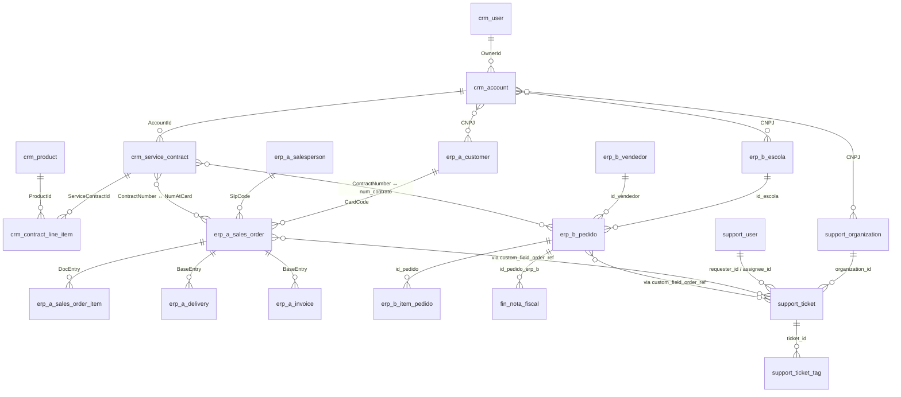

# Case Técnico — Analytics Engineer / Data Engineer

## Contexto

A **Arco Educação** é um dos maiores ecossistemas de educação do Brasil, fornecendo materiais didáticos, soluções digitais e serviços de apoio pedagógico para milhares de escolas em todo o país. A operação da Arco envolve diversas marcas (isaac, COC, SAE, PGS, NSE, entre outras) e um ciclo comercial que vai desde a prospecção de escolas até a entrega de materiais e o suporte pós-venda.

O time de dados da Arco é responsável por construir e manter a camada analítica que permite ao negócio acompanhar esse ciclo de ponta a ponta: **escola → contrato → pedido → entrega → atendimento**.

## O desafio

Você recebeu dados brutos de **cinco sistemas** que fazem parte do dia a dia da operação:


| Sistema                    | Responsabilidade               | O que contém                                                                     |
| -------------------------- | ------------------------------ | -------------------------------------------------------------------------------- |
| **CRM**                    | Equipe comercial               | Cadastro de escolas, usuários internos, contratos de venda, catálogo de produtos |
| **ERP A**                  | Operacional — marca principal  | Pedidos, itens, entregas e notas fiscais (fluxo completo)                        |
| **ERP B**                  | Operacional — marca legado     | Pedidos e itens (sem entrega — usa sistema financeiro externo)                   |
| **Sistema Financeiro**     | Faturamento/logística do ERP B | Notas fiscais e status de entrega dos pedidos do ERP B                           |
| **Sistema de Atendimento** | Pós-venda                      | Cadastro próprio de escolas e usuários, tickets de suporte                       |


A mesma escola pode aparecer nos cinco sistemas com identificadores e formatações diferentes. Os sistemas foram implantados em momentos distintos, por equipes diferentes, e não compartilham um padrão de nomenclatura.

### Perguntas de negócio

A equipe comercial precisa responder duas perguntas com a base que você vai propor:

1. **Visão consolidada de venda por escola, ao longo do tempo.**
  Para cada escola, o time precisa ver — todos os meses — quanto ela pediu, quanto ela recebeu e como esses números evoluíram nos últimos 12 meses, **independentemente da marca da Arco que originou a venda**.
2. **Performance de carteira por Account Manager (AM).**
  Cada AM é dono de uma carteira de escolas. O time comercial quer comparar AMs entre si pelo volume vendido pela carteira no ano corrente.

Em ambas as perguntas, **"valor vendido"** é a soma do valor dos itens dos pedidos confirmados (i.e., não cancelados), independentemente de a entrega já ter sido feita ou não.

> Não se espera que você entregue uma resposta final pra cada pergunta na forma de relatório. O que esperamos é que **as decisões de modelagem propostas permitam que essas perguntas sejam respondidas com poucas linhas de SQL** em cima do modelo.

## Diagrama do ambiente raw

Os dados estão organizados em 20 tabelas, distribuídas pelos cinco sistemas. O diagrama abaixo mostra os relacionamentos internos de cada sistema e algumas pistas sobre como os sistemas se conectam entre si.




### Tabelas por sistema

**CRM** — `crm_user`, `crm_account`, `crm_product`, `crm_service_contract`, `crm_contract_line_item`

**ERP A** — `erp_a_salesperson`, `erp_a_customer`, `erp_a_sales_order`, `erp_a_sales_order_item`, `erp_a_delivery`, `erp_a_invoice`

**ERP B** — `erp_b_vendedor`, `erp_b_escola`, `erp_b_pedido`, `erp_b_item_pedido`

**Sistema Financeiro** — `fin_nota_fiscal` (notas e entrega dos pedidos do ERP B)

**Sistema de Atendimento** — `support_organization`, `support_user`, `support_ticket`, `support_ticket_tag`

> O diagrama mostra os relacionamentos que **conhecemos** dos sistemas. Não assuma que ele está completo — vale explorar os dados pra confirmar (e quem sabe descobrir relações ou inconsistências que ele não mostra).

## O que você deve entregar

A entrega é um **documento (RFC / design doc)** descrevendo sua proposta de modelagem para a base analítica que vai responder às perguntas acima. Aceitamos qualquer formato legível (Google Docs, Notion, Markdown, PDF, .docx) — fique à vontade pra usar o que preferir.

**O foco é o pensamento, não o código.** Você não precisa implementar o modelo — só descrevê-lo de forma que outra pessoa do time consiga entender, criticar e implementar a partir do seu documento.

A **estrutura do documento fica a seu critério** — como você organiza, prioriza e apresenta o conteúdo faz parte da avaliação. O que importa é que o raciocínio fique visível: o entendimento da necessidade, as descobertas que considerou, o caminho até a proposta, e o que mais ajude a tangibilizar suas escolhas.

Como referência, esperamos que a RFC enderece — não necessariamente nessa ordem nem como template — pelo menos: o entendimento do problema e do que foi explorado nos dados, o modelo proposto (entidades, relações, grão de cada tabela), as decisões de modelagem e trade-offs considerados, premissas assumidas, e pontos que ficaram fora do escopo com justificativa.

## Apresentação

Caso sua RFC passe na avaliação, marcamos uma **apresentação ao vivo de 40~50 minutos** (20 min de apresentação + 20-30 min de discussão).

A conversa vai girar em torno do que você propôs e das decisões que tomou no caminho: o que escolheu fazer, o que escolheu não fazer, e por quê. Não há roteiro fixo — você organiza como preferir.

## Como explorar os dados

### Pré-requisitos

Instale o **DuckDB** (versão **1.5.0 ou superior**):

- **macOS**: `brew install duckdb`
- **Windows**: `winget install DuckDB.cli` (ou baixe em [duckdb.org/docs/installation](https://duckdb.org/docs/installation/))
- **Linux / outros**: ver [duckdb.org/docs/installation](https://duckdb.org/docs/installation/)

Para verificar: `duckdb --version`

### Carregando os dados

A pasta `data/` já vem com um `case.duckdb` pronto pra uso — basta abrir:

```bash
cd data/
duckdb case.duckdb
```

Se preferir gerar o banco do zero a partir dos CSVs (ou se quiser conferir o setup), rode:

```bash
cd data/
duckdb case.duckdb -c ".read load.sql"
```

Funciona em macOS, Linux e Windows (cmd e PowerShell). O script carrega as 20 tabelas e imprime a contagem de linhas de cada uma. Os valores esperados são:

| Tabela | Linhas |
|---|---:|
| crm_user | 40 |
| crm_account | 360 |
| crm_product | 60 |
| crm_service_contract | 380 |
| crm_contract_line_item | 1.400 |
| erp_a_salesperson | 25 |
| erp_a_customer | 268 |
| erp_a_sales_order | 1.800 |
| erp_a_sales_order_item | 5.400 |
| erp_a_delivery | 1.500 |
| erp_a_invoice | 1.457 |
| erp_b_vendedor | 20 |
| erp_b_escola | 253 |
| erp_b_pedido | 1.200 |
| erp_b_item_pedido | 2.929 |
| fin_nota_fiscal | 964 |
| support_organization | 310 |
| support_user | 480 |
| support_ticket | 1.500 |
| support_ticket_tag | 3.000 |

Para explorar interativamente:

```bash
duckdb case.duckdb
```

```sql
-- Exemplos de queries iniciais
SHOW TABLES;
DESCRIBE crm_account;
SELECT * FROM crm_account LIMIT 10;
```

Você pode usar qualquer ferramenta que conecte ao DuckDB pra explorar — SQL puro, Python, notebooks, GUIs como DBeaver, etc. Se quiser uma referência de setup com GUI, veja o [guia rápido com DBeaver](guia-dbeaver.md) — é só uma sugestão, sinta-se à vontade pra usar outra coisa. A exploração é meio para a RFC, não entrega.

## Guidelines do time

Na pasta `[guidelines/](guidelines/)` você encontra os guidelines de modelagem do time de dados da Arco. **É esperado que sua RFC dialogue com eles** — citando, aplicando, ou justificando desvios quando fizer sentido. Eles cobrem:

- **[Entity-centric](guidelines/entity-centric.md)** — princípios de modelagem centrada em entidades
- **[Nomenclatura](guidelines/nomenclatura-tabelas-colunas.md)** — convenções de nomes para tabelas e colunas
- **[Camadas de modelagem](guidelines/camadas-modelagem.md)** — camadas (clean/curated/report) e estrutura de pastas em projetos dbt
- **[Estilo SQL](guidelines/estilo-sql-dbt.md)** — padrões de escrita SQL/dbt

Os dois primeiros são especialmente relevantes pro formato de RFC. Os dois últimos podem ser citados estruturalmente (sem precisar de código pra demonstrar).

## Uso de IA

O uso de ferramentas de IA (Copilot, ChatGPT, Claude, etc.) é **permitido e bem-vindo** — assim como acontece no trabalho real do time. O que avaliamos na apresentação é o **entendimento e a capacidade de defender cada decisão**, não a capacidade de produzir o doc de cabeça.

## Prazo

Você tem **7 dias corridos** a partir do recebimento deste material para entregar o documento.

## Dúvidas

Dúvidas sobre **contexto de negócio** podem ser enviadas por email e serão respondidas. Dúvidas sobre **como modelar ou o que fazer com os dados** fazem parte da avaliação — esperamos que você tome essas decisões de forma autônoma e as defenda na apresentação.